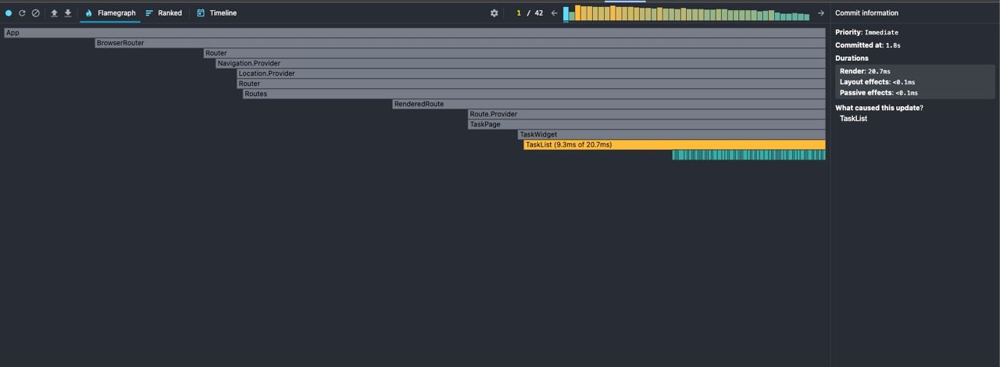
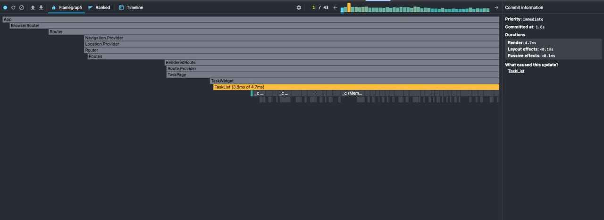

# TaskPage 

## До оптимизации

---

## После оптимизации

1) компонент TaskList продолжает перерисовываться при изменении состояния, что является нормальным поведением;

2) TaskCard больше не перерисовываются без изменения props благодаря React.memo;

3) у DeleteButton не создается новая ссылка на функцию благодаря useCallback.

По сравнению с первым скрином, где каждый TaskCard и DeleteButton ререндерелись, теперь React пропускает дочерние компоненты благодаря мемоизации TaskListItem. Общее время рендера уменьшилось в 5 раз.

